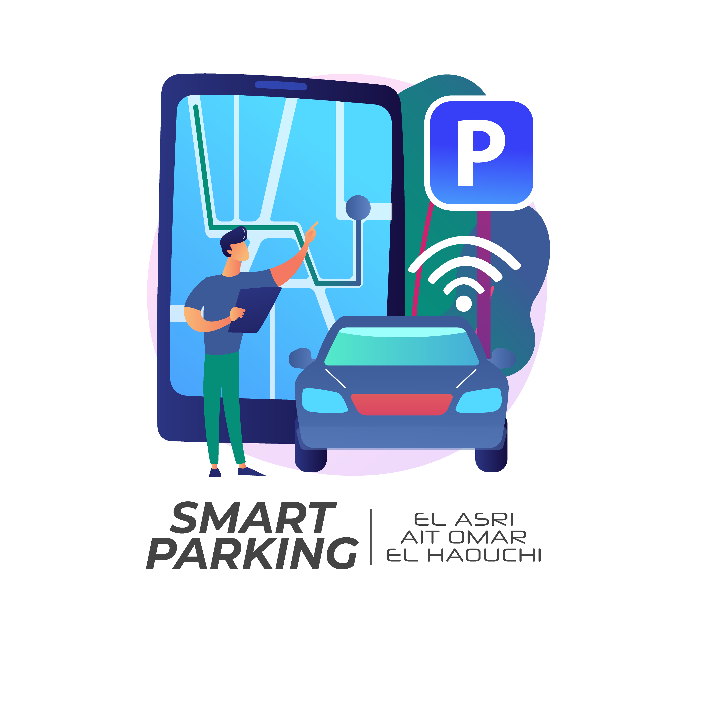

[![LinkedIn][linkedin-shield]][linkedin-url]

<!-- PROJECT LOGO -->
<br />
<p align="center">
  <a href="https://github.com/ElasriAyoub">
    
  </a>

  <h3 align="center">Smart Parking Project</h3>

  <p align="center">
   Using ARDUINO and a JAVA GUI!
    <br />
    <a href="https://github.com/ElasriAyoub"><strong>Check all my projects</strong></a>
    <br />
    <br />
  </p>
</p>

<!-- ABOUT THE PROJECT -->
## About The Project
Parking spots nowadays are fundamental. The increase of vehicles and parkingsmakes it difficult for drivers to find vacant parking spaces rapidly. For a Parking company, it’s hard to supervise all of its parking manually, wasting time, energy, and patience.
In the 21st Century, time is gold. So wasting time is a meager problem to identify the spots of its parking in Real-Time.

Here's the solution:
* Each parking supervisor had a Desktop Application that allows him to track the vehicles in the parking in Real Time.
* Using the technology of Light Sensors (LDR) to track the presence each vehicle.
* Vehicle informations are stored in a Database. 

A good reflection is to answer the questions of type *WWWHW*.
***What*** :
Application for the supervisor to supervise in Real-Time the Occupied/Vacant places
and the state of the barriers.

***Who*** :
Parking supervisors of the parking.

***When*** :
All the time.

***Why*** :
Make the supervising of the parking easy and fast.
Autonomous Parking.

***How*** :
The supervisor authenticates himself to be connected to the interface where he can see the Occupied/Vacant places and if there is a problem within the barriers.
The vehicle will be detected then Arduino will check if there is an empty place then open the barrier or maintain it close.

### Built With

This section should list any major frameworks that you built your project using. Leave any add-ons/plugins for the acknowledgements section. Here are a few examples.
* [JAVA](https://getbootstrap.com)
* [C++](https://jquery.com)
* [Laravel](https://laravel.com)


<!-- GETTING STARTED -->
## Getting Started

This is an example of how you may give instructions on setting up your project locally.
To get a local copy up and running follow these simple example steps.


### Installation

1. Get a free API Key at [https://example.com](https://example.com)
2. Clone the repo
   ```sh
   git clone https://github.com/your_username_/Project-Name.git
   ```
3. Install NPM packages
   ```sh
   npm install
   ```
4. Enter your API in `config.js`
   ```JS
   const API_KEY = 'ENTER YOUR API';
   ```

<!-- CONTRIBUTING -->
## Contributing

Contributions are what make the open source community such an amazing place to be learn, inspire, and create. Any contributions you make are **greatly appreciated**.

1. Fork the Project
2. Create your Feature Branch (`git checkout -b feature/AmazingFeature`)
3. Commit your Changes (`git commit -m 'Add some AmazingFeature'`)
4. Push to the Branch (`git push origin feature/AmazingFeature`)
5. Open a Pull Request


<!-- LICENSE -->
## License

Distributed under the MIT License. See `LICENSE` for more information.


<!-- CONTACT -->
## Contact

Your Name - [@your_twitter](https://twitter.com/your_username) - elasri.ayoub@yahoo.com

Project Link: [https://github.com/ElasriAyoub/Smart-Parking-Arduino-GUI-JAVA](https://github.com/ElasriAyoub/Smart-Parking-Arduino-GUI-JAVA)


<!-- ACKNOWLEDGEMENTS -->
## Acknowledgements
* [GitHub Emoji Cheat Sheet](https://www.webpagefx.com/tools/emoji-cheat-sheet)
* [Img Shields](https://shields.io)
* [Choose an Open Source License](https://choosealicense.com)
* [GitHub Pages](https://pages.github.com)
* [Animate.css](https://daneden.github.io/animate.css)
* [Loaders.css](https://connoratherton.com/loaders)
* [Slick Carousel](https://kenwheeler.github.io/slick)
* [Smooth Scroll](https://github.com/cferdinandi/smooth-scroll)
* [Sticky Kit](http://leafo.net/sticky-kit)
* [JVectorMap](http://jvectormap.com)
* [Font Awesome](https://fontawesome.com)


<!-- MARKDOWN LINKS & IMAGES -->
<!-- https://www.markdownguide.org/basic-syntax/#reference-style-links -->
[contributors-shield]: https://img.shields.io/github/contributors/othneildrew/Best-README-Template.svg?style=for-the-badge
[contributors-url]: https://github.com/ElasriAyoub/graphs/contributors
[forks-shield]: https://img.shields.io/github/forks/othneildrew/Best-README-Template.svg?style=for-the-badge
[forks-url]: https://github.com/othneildrew/Best-README-Template/network/members
[stars-shield]: https://img.shields.io/github/stars/othneildrew/Best-README-Template.svg?style=for-the-badge
[stars-url]: https://github.com/othneildrew/Best-README-Template/stargazers
[issues-shield]: https://img.shields.io/github/issues/othneildrew/Best-README-Template.svg?style=for-the-badge
[issues-url]: https://github.com/othneildrew/Best-README-Template/issues
[license-shield]: https://img.shields.io/github/license/othneildrew/Best-README-Template.svg?style=for-the-badge
[license-url]: https://github.com/othneildrew/Best-README-Template/blob/master/LICENSE.txt
[linkedin-shield]: https://img.shields.io/badge/-LinkedIn-black.svg?style=for-the-badge&logo=linkedin&colorB=555
[linkedin-url]: https://www.linkedin.com/in/elasri-ayoub/
[product-screenshot]: Demo/Smart-Parking.png
